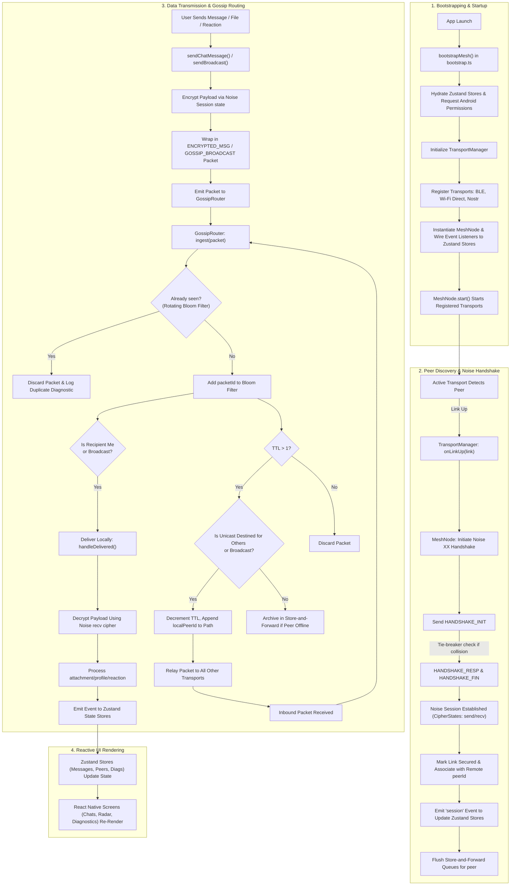

# P2P Mesh Semester Project - Group Presentation Guide

This guide is designed so 4 team members can present the project with equal contribution. It outlines the codebase architecture, complete feature set, a detailed 4-speaker script split with code snippets, and a live demo flow.

---

## 1) Codebase Structure & Runtime Architecture Flow

Use this section in the first 3–5 minutes so the audience understands how the project is organized.

### Root-Level Files
- [App.tsx](file:///c:/Users/harsh/OneDrive/Desktop/p2p-mesh/App.tsx): App root, theme/provider wiring, and initial UI boot sequence.
- [index.js](file:///c:/Users/harsh/OneDrive/Desktop/p2p-mesh/index.js): React Native entry point and runtime bootstrapping.
- [package.json](file:///c:/Users/harsh/OneDrive/Desktop/p2p-mesh/package.json): Project scripts, dependencies, and build/test commands.
- [README.md](file:///c:/Users/harsh/OneDrive/Desktop/p2p-mesh/README.md): Architecture, setup, and project overview.
- `android/`, `windows/`: Platform-native build projects.
- `src/`: Core directory containing all app, protocol, transport, state, and UI logic.

### `src/` High-Level Architecture
- **Cryptographic Core (`src/core/crypto/`)**:
  - [noise.ts](file:///c:/Users/harsh/OneDrive/Desktop/p2p-mesh/src/core/crypto/noise.ts): Noise XX handshake (`Noise_XX_25519_AESGCM_SHA256`) and cipher session state-machines.
  - [identity.ts](file:///c:/Users/harsh/OneDrive/Desktop/p2p-mesh/src/core/crypto/identity.ts): Local keypair generation and peer fingerprinting.
- **Protocol Rules (`src/core/protocol/`)**:
  - [packet.ts](file:///c:/Users/harsh/OneDrive/Desktop/p2p-mesh/src/core/protocol/packet.ts): Packet format serialization and deserialization.
  - [gossip.ts](file:///c:/Users/harsh/OneDrive/Desktop/p2p-mesh/src/core/protocol/gossip.ts): Store-and-forward routing, relaying, and hop-tracking.
  - [bloom.ts](file:///c:/Users/harsh/OneDrive/Desktop/p2p-mesh/src/core/protocol/bloom.ts): Double-hash Bloom filter for duplicate packet prevention.
  - [messageEnvelope.ts](file:///c:/Users/harsh/OneDrive/Desktop/p2p-mesh/src/core/protocol/messageEnvelope.ts): Chat message envelope serialization (text, reactions, profile updates, and file transfers).
  - [fileTransfer.ts](file:///c:/Users/harsh/OneDrive/Desktop/p2p-mesh/src/core/protocol/fileTransfer.ts): Constants and serialization helpers for split/reassembly of files.
- **Connectivity Adapters (`src/core/transport/`)**:
  - [ble.ts](file:///c:/Users/harsh/OneDrive/Desktop/p2p-mesh/src/core/transport/ble.ts), [wifiDirect.ts](file:///c:/Users/harsh/OneDrive/Desktop/p2p-mesh/src/core/transport/wifiDirect.ts), [nostr.ts](file:///c:/Users/harsh/OneDrive/Desktop/p2p-mesh/src/core/transport/nostr.ts), and [simulator.ts](file:///c:/Users/harsh/OneDrive/Desktop/p2p-mesh/src/core/transport/simulator.ts).
  - [transportManager.ts](file:///c:/Users/harsh/OneDrive/Desktop/p2p-mesh/src/core/transport/transportManager.ts): Multiplexes all transports under a unified interface.
- **Mesh Orchestration (`src/core/mesh/`)**:
  - [meshNode.ts](file:///c:/Users/harsh/OneDrive/Desktop/p2p-mesh/src/core/mesh/meshNode.ts): Manages identities, active Noise sessions, and packet routing.
  - [bootstrap.ts](file:///c:/Users/harsh/OneDrive/Desktop/p2p-mesh/src/core/mesh/bootstrap.ts): Single-entry bootloader orchestrating startup.
  - [fileTransferManager.ts](file:///c:/Users/harsh/OneDrive/Desktop/p2p-mesh/src/core/mesh/fileTransferManager.ts): Drives chunked file split/reassembly and integrity verification.
- **Zustand State Stores (`src/state/`)**:
  - [peersStore.ts](file:///c:/Users/harsh/OneDrive/Desktop/p2p-mesh/src/state/peersStore.ts), [messagesStore.ts](file:///c:/Users/harsh/OneDrive/Desktop/p2p-mesh/src/state/messagesStore.ts), [diagnosticsStore.ts](file:///c:/Users/harsh/OneDrive/Desktop/p2p-mesh/src/state/diagnosticsStore.ts), [profileStore.ts](file:///c:/Users/harsh/OneDrive/Desktop/p2p-mesh/src/state/profileStore.ts), and [fileTransferStore.ts](file:///c:/Users/harsh/OneDrive/Desktop/p2p-mesh/src/state/fileTransferStore.ts).
- **Presentation Layer (`src/ui/`, `src/navigation/`)**:
  - `screens/`: Application views (Chats, Radar, Diagnostics, Profile, Settings).
  - `components/`: UI widgets ([MeshRadarView.tsx](file:///c:/Users/harsh/OneDrive/Desktop/p2p-mesh/src/ui/components/MeshRadarView.tsx), MessageBubble, SignalBar, PathTraceChip, PeerAvatar, and PollBuilderOverlay).

### Project Flow Architecture Diagram

The runtime interactions from physical connection to UI rendering are mapped out below:



---

## 2) Features Provided by the Project

### Networking and Security
- **Fully Decentralized Mesh**: Zero reliance on a central server, databases, or third-party accounts.
- **Noise Protocol XX Handshake**: Utilizes `Noise_XX_25519_AESGCM_SHA256` for secure mutual authentication and session key derivation.
- **End-to-End Encrypted Unicast**: Individual chats utilize per-session send/receive ciphers.
- **Bloom Filter Duplicate Suppression**: Rotating [RotatingBloom](file:///c:/Users/harsh/OneDrive/Desktop/p2p-mesh/src/core/protocol/bloom.ts) filter prevents infinite packet loops and replay attacks.
- **Gossip Relaying**: Dynamic broadcast and message forwarding with TTL controls and path-tracing.
- **Store-and-Forward Queueing**: Unicast packets bound for currently offline peers are temporarily cached and automatically flushed when the peer joins the mesh.

### Chunked File Transfer Architecture
- **Automatic Split & Reassembly**: Files larger than 180 KiB are dynamically chunked into fixed 48 KiB base64 segments to prevent packet size overflows (hard limit of 60 KiB).
- **Progress Tracking**: Local Zustand [fileTransferStore.ts](file:///c:/Users/harsh/OneDrive/Desktop/p2p-mesh/src/state/fileTransferStore.ts) records real-time transmission rates for both outbound and inbound flows.
- **SHA-256 Checksum Verification**: Enforces end-to-end payload integrity; files are discarded if reassembled bytes do not match the header digest.
- **Resilient Delivery**: Implements a voluntary small yield (10ms pause every 5 chunks) to keep the React Native Javascript thread unblocked during high-volume reads.

### Multi-Transport Network Fabric
- **BLE Transport**: Leverages `react-native-ble-plx` with native service UUID discovery and discovery diagnostics.
- **Wi-Fi Direct Transport**: Bridges to platform-native Wi-Fi Direct interfaces.
- **Nostr Relay Carrier Wave**: Optionally routes encrypted packets through public Nostr relays (`Damus`, `Nos.lol`, `Snort`) as an internet-assisted transport backhaul.
- **Simulator Transport**: Models synthetic network nodes, RSSI drift, and connection churn to demo the app's routing features under non-radio environments.

### UX & Interface Design
- **Windows Shell**: 3-pane Fluent-style layout incorporating Microsoft **Mica** backdrops, **Acrylic** navigation sidebars, and fluid navigation transitions.
- **Android Shell**: Material Design 3 layout utilizing extra-rounded surfaces and dynamic color palette adaptation.
- **Pulse Mesh Radar**: SVG + Reanimated real-time map displaying peers dynamically. Radial distance reflects RSSI link quality, and connecting paths are color-coded by hop count (Green = Direct, Yellow = 1-Hop, Red = Multi-hop).
- **Interactive Chats**: Message bubbles showing hop indicators and interactive **Path Trace Chips** representing the exact packet routes.

---

## 3) Equal 4-Person Presentation Split (Code + Explanation)

Recommended presentation length: 24–32 minutes (6–8 minutes per speaker).

---

### Speaker 1 - System Architecture, Bootstrapping & State
**Responsibility**: Explain application initialization, permission request procedures, modular layout, and the binding of network event streams to frontend stores.

**Key Talking Points**:
- Decoupled architecture: strict division between cryptography, packet protocols, network transports, state management, and visual components.
- The `bootstrapMesh` process: handles device permission checking on Android and hydrates profiles, messages, and directory states prior to starting network radios.
- Resilient multiplexing: registering transport engines securely without letting a hardware error in one transport block the app lifecycle.

#### Code Snippet A: Mesh bootstrapping and transport registration
Source: [bootstrap.ts](file:///c:/Users/harsh/OneDrive/Desktop/p2p-mesh/src/core/mesh/bootstrap.ts#L33-L49)
```ts
  await requestTransportPermissions();
  const allowNostrGateway = await getAllowNostrGateway();
  const tm = new TransportManager();
  
  if (Platform.OS === 'android' || Platform.OS === 'ios') {
    tm.add(new BleTransport());
    tm.add(new WifiDirectTransport());
  }
  if (Platform.OS === 'windows') {
    tm.add(new BleTransport());
    tm.add(new WifiDirectTransport());
  }
  if (allowNostrGateway) {
    tm.add(new NostrTransport());
  }

  const n = new MeshNode(tm, profile.identity);
  setMeshNode(n);
```

#### Code Snippet B: Wiring runtime events to Zustand stores
Source: [bootstrap.ts](file:///c:/Users/harsh/OneDrive/Desktop/p2p-mesh/src/core/mesh/bootstrap.ts#L51-L55)
```ts
  // wire UI stores
  n.on('links', links => usePeersStore.getState().setPeers(links));
  n.on('session', () => usePeersStore.getState().setPeers(tm.allLinks()));
  n.on('message', msg => useMessagesStore.getState().push(msg));
  n.on('diag', e => useDiagnosticsStore.getState().push(e));
```

**Speaker Handoff Line**:
> *"Before the application presents any chat screen, it establishes a multiplexed transport manager, binds events directly to state stores, and is ready to establish secure tunnels—which Speaker 2 will now explain."*

---

### Speaker 2 - Cryptography and Protocol Core
**Responsibility**: Explain secure peer-to-peer session creation (Noise XX Handshake), the packet header format, Bloom filter loop-prevention, and gossip-based routing.

**Key Talking Points**:
- **Noise XX (2-way authentication)**: Perfect for peer-to-peer because neither side needs to trust a central authority; identities are verified by exchanging public keys on-the-fly.
- **Rotating Bloom Filter**: Memory-efficient duplicate packet checker using a double-hash logic that regularly sweeps out stale IDs so memory remains capped.
- **Gossip Routing & TTL**: How message packets decrement TTL at every hop, gather route tracing paths, and route around dead spots.

#### Code Snippet A: Mutual authentication handshake execution
Source: [noise.ts](file:///c:/Users/harsh/OneDrive/Desktop/p2p-mesh/src/core/crypto/noise.ts#L295-L308)
```ts
  const init = new NoiseInitiator(initiatorKeys);
  const resp = new NoiseResponder(responderKeys);

  const m1 = init.writeMessage1();
  resp.readMessage1(m1);
  const m2 = resp.writeMessage2();
  init.readMessage2(m2);
  const {message: m3, session: initiator} = init.writeMessage3();
  const responder = resp.readMessage3(m3);
```

#### Code Snippet B: Gossip Router duplicate protection and packet routing
Source: [gossip.ts](file:///c:/Users/harsh/OneDrive/Desktop/p2p-mesh/src/core/protocol/gossip.ts#L57-L92)
```ts
  ingest(packet: MeshPacket, fromLinkId?: string): void {
    if (this.seen.has(packet.packetId)) {
      this.delegate.diag('PACKET_DUPLICATE', { id: packet.packetId.slice(0, 8) });
      return;
    }
    this.seen.add(packet.packetId);

    const me = this.delegate.localPeerId;
    const isForUs = packet.recipientId === me || packet.recipientId === ZERO_PEER;

    if (isForUs) {
      this.delegate.deliver({
        packet,
        receivedAtMs: Date.now(),
        hopCount: Math.max(0, packet.path.length - 1),
        latencyMs: Math.max(0, Date.now() - packet.timestampMs),
      });
    }

    const shouldForward = packet.ttl > 1 && (packet.recipientId !== me || packet.recipientId === ZERO_PEER);
    if (shouldForward) {
      const relayed = relayPacket(packet, me);
      this.delegate.broadcast(encodePacket(relayed), fromLinkId);
    }
  }
```

**Speaker Handoff Line**:
> *"This cryptographic engine guarantees that all peer packets are deduped, securely encrypted, and correctly forwarded across physical adapters, which Speaker 3 will show in detail."*

---

### Speaker 3 - Transports & Chunked File Transfer
**Responsibility**: Explain native connectivity mapping, handshake tie-breakers, and the chunked file transfer protocol that overcomes packet payload limits.

**Key Talking Points**:
- **Resilient Transport abstraction**: Translating very different physical radios (BLE, Wi-Fi Direct, Nostr Relays) into unified stream frames.
- **Handshake Collision Handling**: Resolving tie-breakers (when both sides connect and trigger handshakes simultaneously) using static public key lexical order.
- **Chunked File Pipeline**: Splitting binary streams into 48 KiB packets, sequencing transmission, tracking delivery states, and validating files via SHA-256 digests.

#### Code Snippet A: Resilient multi-transport startup
Source: [transportManager.ts](file:///c:/Users/harsh/OneDrive/Desktop/p2p-mesh/src/core/transport/transportManager.ts#L23-L41)
```ts
  async start(events: ManagerEvents) {
    this.events = events;
    const inner: TransportEvents = {
      onLinkUp: link => {
        events.onLinkUp(link);
        events.onLinks(this.allLinks());
      },
      onLinkDown: link => {
        events.onLinkDown(link);
        events.onLinks(this.allLinks());
      },
      onPacket: (linkId, bytes) => events.onPacket(linkId, bytes),
      onRssi: (linkId, rssi) => events.onRssi(linkId, rssi),
    };
    // If one native radio fails to init, do not crash the other active adapters
    await Promise.allSettled(this.transports.map(t => t.start(inner)));
    events.onLinks(this.allLinks());
  }
```

#### Code Snippet B: Outbound chunked file transfer dispatcher
Source: [fileTransferManager.ts](file:///c:/Users/harsh/OneDrive/Desktop/p2p-mesh/src/core/mesh/fileTransferManager.ts#L91-L121)
```ts
  try {
    // 1. Send header containing file size, name, chunks count, and SHA-256
    await send({
      kind: 'file_transfer_header',
      transferId,
      fileName,
      fileSize: fileBytes.byteLength,
      mimeType,
      totalChunks,
      checksum,
      attachmentType,
    });

    // 2. Dispatch chunks sequentially with a small thread yield
    for (let i = 0; i < chunks.length; i++) {
      await send({
        kind: 'file_transfer_chunk',
        transferId,
        chunkIndex: i,
        data: chunks[i],
      });
      useFileTransferStore.getState().updateProgress(transferId, i + 1);

      if (i % 5 === 4) {
        await new Promise<void>(r => setTimeout(r, 10)); // unblocks React Native UI
      }
    }
    useFileTransferStore.getState().completeTransfer(transferId);
  }
```

**Speaker Handoff Line**:
> *"Now that we have covered how raw packets and files traverse these transports, Speaker 4 will guide you through the interactive presentation and radar screens."*

---

### Speaker 4 - UI, State, and User Experience
**Responsibility**: Explain React Native component layouts, path-tracing UI, the math behind radar node positioning, and local data persistence.

**Key Talking Points**:
- **Platform Adaptability**: Displaying a 3-pane Fluent structure on Windows using native theme hooks, and an Material 3 layout on Android devices.
- **Zustand & AsyncStorage Integration**: Loading conversation history from device secure storage, appending messages Reactively, and automatically mapping keys.
- **Radar physics**: Utilizing React Native Reanimated to model node drifts and translating radio RSSI values to SVG display radii.

#### Code Snippet A: Thread-safe storage persistence mapped by peer ID
Source: [messagesStore.ts](file:///c:/Users/harsh/OneDrive/Desktop/p2p-mesh/src/state/messagesStore.ts#L57-L70)
```ts
    const key =
      msg.toPeerId === ZERO_PEER
        ? BROADCAST_KEY
        : msg.fromPeerId === me
          ? msg.toPeerId
          : msg.fromPeerId;
    const existing = state.byPeer[key] ?? [];
    if (existing.some(m => m.id === msg.id)) return state;
    
    const byPeer = { ...state.byPeer, [key]: [...existing, msg] };
    AsyncStorage.setItem(STORAGE_KEY, JSON.stringify(byPeer)).catch(() => undefined);
    return { byPeer };
```

#### Code Snippet B: Translating signal strength (dBm) to radar radii
Source: [MeshRadarView.tsx](file:///c:/Users/harsh/OneDrive/Desktop/p2p-mesh/src/ui/components/MeshRadarView.tsx#L58-L64)
```ts
function rssiToDistance(rssi: number): number {
  if (rssi >= -45) return 0.18; // Close proximity
  if (rssi >= -60) return 0.35;
  if (rssi >= -75) return 0.55;
  if (rssi >= -85) return 0.75;
  return 0.92;                  // Edge of detection limits
}
```

**Speaker Conclusion Line**:
> *"Our user experience ties this entire complex backend together: providing an interface that is beautiful, secure, and intuitive for decentralized, serverless communication."*

---

## 4) Team Demo Flow & Contribution Checklist

### Contribution Checklist
- **Timing**: Each speaker takes 6–8 minutes.
- **Demonstration**: Explain the code snippets directly inside the slide presentation.
- **Design Context**: Focus not just on *what* the code does, but *why* the architectural design was selected.

### Live Demo Script Split
1. **Presenter 1 (Bootstrapping & Setup)**: Boot the application on both Windows and Android simulator screens. Open the *Diagnostics Dashboard* and show the initialization of the transports.
2. **Presenter 2 (Noise Handshake Verification)**: Select a simulated peer node. Point out the Noise handshake completion sequence (`NOISE_HANDSHAKE_OK`) inside the Diagnostics logs.
3. **Presenter 3 (Chat Routing & File Transfer)**: Send a message and then a large image file. Demonstrate how the *file transfer store* tracks chunk progress bar values and displays completed attachments in the conversation window.
4. **Presenter 4 (Radar & Path Trace Visuals)**: Show the *Mesh Radar* screen, detailing the RSSI distance positioning. Click the **Path Trace Chip** on a message to view the multi-hop routing paths.

---

## 5) Advanced Q&A Preparation

- **Q: Why was the Noise Protocol XX handshake selected over Noise IK?**
  - **A**: The Noise XX pattern requires no pre-shared static keys (0-RTT configurations), which is necessary for serverless environments where users discover each other dynamically. It establishes mutual authentication in a single round-trip (1.5-RTT), verifying identities safely.
- **Q: How does the rotating Bloom filter prevent replay exhaustion while protecting memory?**
  - **A**: The Bloom filter checks if a unique `packetId` has been processed before. To prevent memory leakage, it rotates across multiple time-based windows. Older windows are discarded, ensuring a fixed memory ceiling while preserving protection against immediate loop hazards.
- **Q: What happens if a handshake collision occurs (two nodes initiating simultaneously)?**
  - **A**: If a node receives a `HANDSHAKE_INIT` from a peer it is already attempting to connect with, a tie-breaker evaluates the static public keys. The peer with the smaller key ID proceeds as the initiator; the other resets its handshake state to act as the responder.
- **Q: How is file integrity verified across chunked transfers?**
  - **A**: The sender computes a SHA-256 checksum of the entire file bytes before chunking. This is sent inside the header envelope. The receiver collects all chunks in memory, reassembles them, and computes the SHA-256 of the reassembled object. If the hashes mismatch, the file is rejected.
